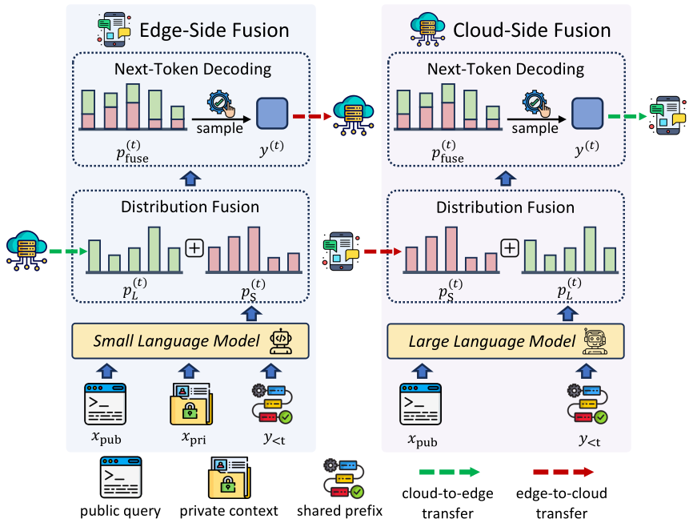
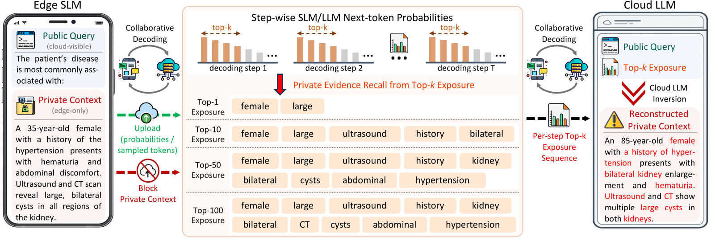

<div align="center">

# Auditing and Mitigating Privacy Leakage in Cloud-Edge Collaborative Decoding

[**Kejia Zhang**](https://kejiazhang-robust.github.io/) · [**Tianyuan Zou**](https://openreview.net/profile?id=~Tianyuan_Zou1) · [**Zixuan Gu**](https://openreview.net/profile?id=~Zixuan_GU1) · [**Yang Liu**](https://openreview.net/profile?id=~Yang_Liu59)

[](https://2026.emnlp.org/)
[](https://www.python.org/)
[](LICENSE)
[](#data)

</div>

> **TL;DR:** Cloud-edge collaborative decoding can expose private context through shared probabilities or tokens, even when sensitive data remain on-device. We evaluate this leakage and propose a training-free defense improving privacy-utility trade-offs.

## Two fusion modes

<p align="center">
  
</p>

<p align="center"><sub><b>Figure 1 · Two collaborative decoding modes.</b> Edge-side fusion returns a sampled token to the cloud; cloud-side fusion uploads SLM probabilities. Both keep raw private context on-device while exposing token- or logit-level signals.</sub></p>

## Privacy risk: private context exposure and inversion

<p align="center">
  
</p>

<p align="center"><sub><b>Figure 2 · Private context exposure and inversion.</b> Cloud-observed top-<i>K</i> signals can expose private context, and their step-wise sequence can be used by the cloud LLM to reconstruct it.</sub></p>

## Run

```bash
export LARGE_MODEL=/path/to/large-model
export SMALL_MODEL=/path/to/small-model
export DATASET=dataset/MEDPRIV.jsonl

bash sh/LM_fusion_defense.sh   # cloud-side fusion
bash sh/SM_fusion_defense.sh   # edge-side fusion
```

## Evaluate

```bash
RESULTS=outputs/cloud_side/results.jsonl \
TOKENIZER="$LARGE_MODEL" \
bash sh/evaluate.sh
```

`Accuracy` · `Token-ER@K` · `ROUGE1-ER@K` · `Span-ER@K` · `AUC@K` · `ROUGE-1 Recall/F1`

## Data

[**MedPriv**](dataset/MEDPRIV.jsonl) · [**CommPriv**](dataset/COMMPRIV.jsonl)

<p align="center"><sub>Apache-2.0 licensed code · Dataset terms follow the original sources.</sub></p>
